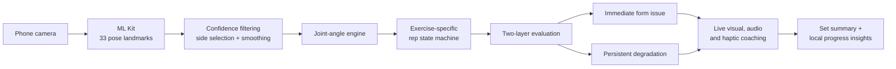

# Right Posture

### Your phone can count a rep. Right Posture understands what happened inside it.

[](mobile/)
[](#privacy-by-design)
[](#built-to-be-trusted)
[](#why-right-posture-deserves-to-win)

**Right Posture is a private, real-time movement coach that uses only a phone camera to understand exercise form.** It turns 33 body landmarks into joint angles, rep phases, form evidence, live cues, and meaningful progress insights—with no wearable, no cloud inference, and no recorded video.

Most fitness apps answer one question: *Did you complete a rep?* Right Posture answers the more important ones:

- Was the movement within a safe, useful range?
- Is the user's form gradually deteriorating as fatigue sets in?
- What exactly changed, and what should they do on the next rep?
- Is their movement quality improving across workouts—not merely their rep count?

> **The breakthrough:** one configurable evaluation pipeline detects both an immediately incorrect movement and gradual form degradation across a set. It does not merely count motion; it interprets movement quality over time.

---

## The problem

At-home exercise gives people freedom, but removes the feedback loop that makes movement effective. A person can complete every scheduled rep while unknowingly shortening their range, rushing the return, or losing form as they fatigue.

Existing solutions commonly fall into two camps:

| Typical product | What it sees | What it misses |
|---|---|---|
| Rep counter | Movement completion | Why the rep was weak |
| Workout tracker | Volume and streaks | Movement quality |
| Remote video service | A recorded or streamed session | Privacy, offline access, instant local feedback |
| **Right Posture** | **Range, tempo, confidence, rep phase, immediate faults, and degradation trends** | **Built specifically to close the feedback gap** |

Right Posture brings a compact movement-analysis system into a device people already own.

## How it works



1. **See:** Google ML Kit detects 33 pose landmarks from the live camera feed.
2. **Stabilize:** confidence propagation, rolling-median smoothing, side locking, and interruption recovery reject unreliable frames.
3. **Understand:** hand-written joint-angle math and exercise-specific state machines identify deliberate attempts and completed reps.
4. **Evaluate:** the first valid reps establish a personal baseline; the engine then checks both absolute movement limits and persistent change from that baseline.
5. **Coach:** the app converts structured evidence into one clear, prioritized cue—visual, spoken, and haptic.
6. **Learn:** summary-only history reveals trends, recurring issues, records, and workout-to-workout progress.

## What makes it revolutionary

### 1. It recognizes degradation, not just failure

A rep can be technically complete while being meaningfully worse than the user's earlier reps. Right Posture establishes a session baseline and looks for persistent drift, allowing it to identify fatigue-related form change that a threshold-only counter cannot see.

### 2. Personalization happens locally and instantly

There is no account setup or historical model training required. Calibration happens during the set, against the user's own visible movement, so feedback is relevant from the first session.

### 3. Privacy is part of the architecture

Camera frames, pose images, and raw landmark streams are never saved. Only bounded workout summaries are persisted. The analysis remains on the device, works without a backend, and avoids turning a private workout into cloud data.

### 4. Feedback is evidence, not generic encouragement

Every cue is produced from a structured issue containing the exercise, affected metric, direction of error, measured value, baseline, and severity. The same evidence powers live coaching, accessibility text, summaries, and analytics.

## Product experience

Right Posture is designed as one calm, guided flow:

**Choose exercise → learn the movement → position the phone → complete the countdown → receive live coaching → review the set → compare the workout → track progress**

Key capabilities include:

- Real-time skeleton overlay and tracking diagnostics
- Exercise-aware camera placement guidance
- Automatic readiness detection and cancellable 3–2–1 countdown
- Detection of partial attempts without falsely adding reps
- Live range, tempo, confidence, and direction-aware coaching
- Prioritized visual, text-to-speech, sound, and haptic cues
- Detailed rep timeline and component score breakdown
- Multi-set workout comparison
- Local workout journal, metric trends, issue frequency, and evidence-linked insights
- First-visit guided demo and accessible, responsive interfaces
- Camera/lifecycle recovery and an always-awake live-session screen

## Exercise coverage

The engine uses shared movement contracts with exercise-specific profiles and detectors, making the system extensible without duplicating the entire pipeline.

| Exercise | Software status |
|---|---|
| Squat | Implemented and regression-tested |
| Bicep curl | Implemented; target-device validation pending |
| Lateral raise | Implemented; target-device validation pending |
| Shoulder press | Implemented; target-device validation pending |
| Reverse lunge | Planned in the six-exercise architecture |
| Jumping jack | Planned in the six-exercise architecture |

Only exercises that pass their complete software and physical-device release gates are intended to appear in the demo build.

## Built to be trusted

This is not a clickable concept. It is a working Flutter application with a real camera pipeline and a deliberately testable domain engine.

- **169 automated tests passing** in the current repository
- Clean Flutter static analysis at every completed iteration
- Debug APK built successfully across implementation gates
- Boundary, low-confidence, partial-attempt, timing, lifecycle, analytics, persistence, and responsive-UI coverage
- Deterministic feedback instead of opaque generated advice
- Conservative product language: movement and form coaching, not diagnosis or clinical treatment

Physical iQOO performance, final detector thresholds, camera transforms, and audio/haptic timing remain explicit device-validation gates. We would rather show judges honest engineering evidence than hide uncertainty behind an unsupported claim.

## Privacy by design

| Data | Leaves the device? | Persisted? |
|---|---:|---:|
| Camera frames | No | No |
| Pose landmarks | No | No |
| Raw movement samples | No | No |
| Settings and guided-demo state | No | Yes, locally |
| Bounded workout summaries | No | Yes, locally |

No backend. No account. No cloud pose inference. No retained workout footage.

## Technology

| Layer | Technology | Why it is here |
|---|---|---|
| Application | Flutter + Dart | Fast, responsive mobile product development |
| State | Riverpod | Predictable session and settings lifecycle |
| Camera | Flutter `camera` | Live frame access and camera control |
| Pose estimation | Google ML Kit Pose Detection | On-device 33-landmark pose estimation |
| Movement intelligence | Custom Dart domain engine | Angles, smoothing, rep states, calibration, and degradation logic |
| Feedback | TTS, audio, and haptics | Timely coaching without requiring the user to watch the screen |
| Analytics | Custom summaries + `fl_chart` | Explainable, evidence-linked progress views |
| Storage | `shared_preferences` | Small, bounded, versioned local summary history |

## Run the project

### Requirements

- Flutter 3.48.0-0.3.pre / Dart 3.13.0, or a compatible newer SDK
- Android SDK 36 and JDK 17
- Android API 24+ device with a camera
- USB debugging for physical-device development

### Setup

```bash
git clone <repository-url>
cd right_posture/mobile
flutter pub get
flutter analyze
flutter test
flutter run -d <device-id>
```

Grant camera access when prompted. A physical Android device is recommended because ML Kit pose detection is the core experience; web and desktop are not supported demo targets.

## A judge-ready 3-minute demo

1. **Show privacy and immediacy:** enable airplane mode and begin a live session.
2. **Show understanding:** perform clean reps and let the app establish its personal baseline.
3. **Show an immediate issue:** deliberately shorten the movement and display the evidence-based correction.
4. **Show degradation:** allow form to drift across successive reps and demonstrate persistence-aware coaching.
5. **Show lasting value:** end the set and open the rep breakdown, workout comparison, and local analytics.

One continuous flow demonstrates the camera pipeline, on-device AI, custom movement algorithm, multimodal feedback, and progress system—without a prerecorded result or cloud round trip.

## Why Right Posture deserves to win

| Judging dimension | Our evidence |
|---|---|
| **Impact** | Makes movement-quality feedback accessible with hardware people already own |
| **Innovation** | Detects immediate form issues and gradual degradation through one baseline-aware pipeline |
| **Technical depth** | Real-time pose processing, confidence-aware geometry, rep state machines, temporal evaluation, and deterministic coaching |
| **Product quality** | Guided end-to-end flow, multimodal feedback, analytics, resilience handling, and extensive automated tests |
| **Creative phone use** | Turns the camera and local compute into a private movement-analysis system |
| **Feasibility** | No backend dependency, no special sensor, and a bounded Android architecture built for live demonstration |

Right Posture is more than an AI rep counter. It is a foundation for private, accessible movement intelligence: a system that can help a person understand not only **how much** they moved, but **how their movement changed**.

That shift—from counting activity to understanding quality—is the future we are building.

## Repository map

```text
right_posture/
├── mobile/       # Flutter application, domain engine, UI, and tests
├── basemode/     # Product decisions, architecture, designs, and iteration specs
├── execution/    # Approval-gated implementation plans
└── progress.md   # Evidence, completed gates, risks, and current status
```

## Current scope and responsible claims

Right Posture is a hackathon-stage movement and exercise-form coach, not a medical device. It does not diagnose injuries, replace a physiotherapist, or guarantee injury prevention. The current release target is Android, with final tuning and compatibility verification performed on the target iQOO hardware before judging.

## Team

**Built for the iQOO Hackathon 2026 — HealthTech Track.**

Add team members, roles, demo video, pitch deck, and contact details here before submission.

---

<p align="center"><strong>Right Posture — Move with evidence. Improve with confidence.</strong></p>
